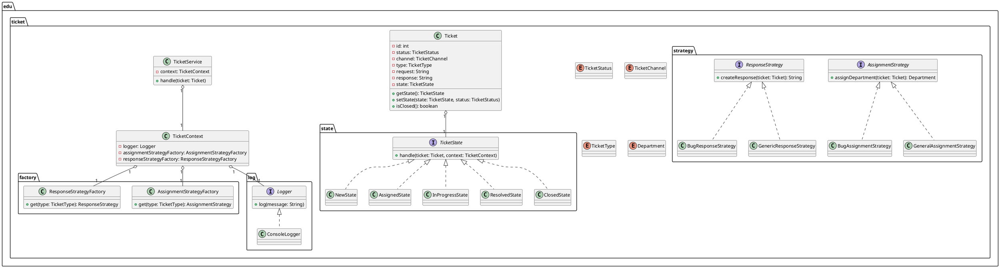

# HW-02 (Patterns) — Ticketing

این پروژه یک نمونه‌ی ساده از «سیستم مدیریت تیکت پشتیبانی» است که در ابتدا با **کد شرطی (if/else) و رشته‌ها** پیاده‌سازی شده بود و نگهداری/توسعه‌پذیری پایین داشت.

طبق صورت تمرین، بازطراحی انجام شده و از الگوهای طراحی برای بهبود کیفیت استفاده شده است.

---

## 1) زیرمسئله‌ها و الگوی طراحی پیشنهادی

### 1.1 چرخه عمر و رفتار وابسته به وضعیت (Ticket Lifecycle) → **State**
**مسئله:** رفتار سیستم در وضعیت‌های `NEW/ASSIGNED/IN_PROGRESS/RESOLVED/CLOSED` متفاوت است و در کد اولیه با `if`‌های متعدد و وضعیت‌های متنی کنترل می‌شد.

**راه‌حل:** هر وضعیت به یک کلاس جدا تبدیل شد:
- `TicketState` (interface)
- `NewState`, `AssignedState`, `InProgressState`, `ResolvedState`, `ClosedState`

هر State مسئول رفتار خودش و انتقال به وضعیت بعدی است.

### 1.2 تصمیم‌های قابل تغییر (تخصیص/پاسخ) → **Strategy**
**مسئله:** با اضافه شدن نوع جدید تیکت (مثلاً `BILLING`) باید چندین `if/else` در بخش‌های مختلف تغییر کند.

**راه‌حل:** رفتارهای قابل تغییر جدا شدند:
- `AssignmentStrategy` برای تعیین واحد رسیدگی
- `ResponseStrategy` برای تولید پاسخ

### 1.3 انتخاب Strategy مناسب → **Factory**
**مسئله:** انتخاب استراتژی‌ها هم با `if` انجام می‌شد.

**راه‌حل:** ساخت/انتخاب استراتژی بر اساس `TicketType` در Factory متمرکز شد:
- `AssignmentStrategyFactory`
- `ResponseStrategyFactory`

---

## 2) نمودار کلاس (Class Diagram)

> PlantUML



---

## 3) اعمال الگوها روی کد

- رشته‌ها به Enum تبدیل شدند: `TicketStatus`, `TicketChannel`, `TicketType`
- ماشین وضعیت با State پیاده‌سازی شد (`TicketState` و وضعیت‌های مختلف)
- تخصیص و پاسخ‌دهی با Strategy پیاده‌سازی شد
- انتخاب Strategy از طریق Factory انجام می‌شود
- لاگ‌گیری به یک abstraction (`Logger`) منتقل شد

---

## 4) تحلیل اصول شی‌گرایی (SOLID + PLK + CRP)

### SRP (Single Responsibility)
- **قبل:** `TicketService` هم مدیریت چرخه عمر را انجام می‌داد، هم تصمیم‌های نوع تیکت و هم لاگ‌گیری.
- **بعد:**
  - State فقط رفتار هر وضعیت و انتقال را مدیریت می‌کند.
  - Strategy فقط رفتارهای قابل تغییر (assign/response) را پیاده می‌کند.
  - Service فقط orchestration را انجام می‌دهد.

### OCP (Open/Closed)
- **قبل:** اضافه کردن نوع جدید تیکت = تغییر چندین if/else.
- **بعد:** اضافه کردن نوع جدید با افزودن Strategy جدید و ثبت در Factory انجام می‌شود.

### PLK (Principle of Least Knowledge)
- وابستگی مستقیم کلاس‌ها به جزئیات داخلی (رشته‌ها و ifهای متعدد) کم شد و ارتباط‌ها از طریق interface انجام می‌شود.

### CRP (Common Reuse Principle)
- استراتژی‌ها و stateها در پکیج‌های جدا قرار گرفتند؛ کلاس‌هایی که با هم تغییر می‌کنند کنار هم هستند و بقیه کمتر تحت تاثیر تغییرات قرار می‌گیرند.

---

## اجرا

در مسیر `Ticketing/src`:

```bash
javac -d out $(find src -name "*.java")
java -cp out Main
```
